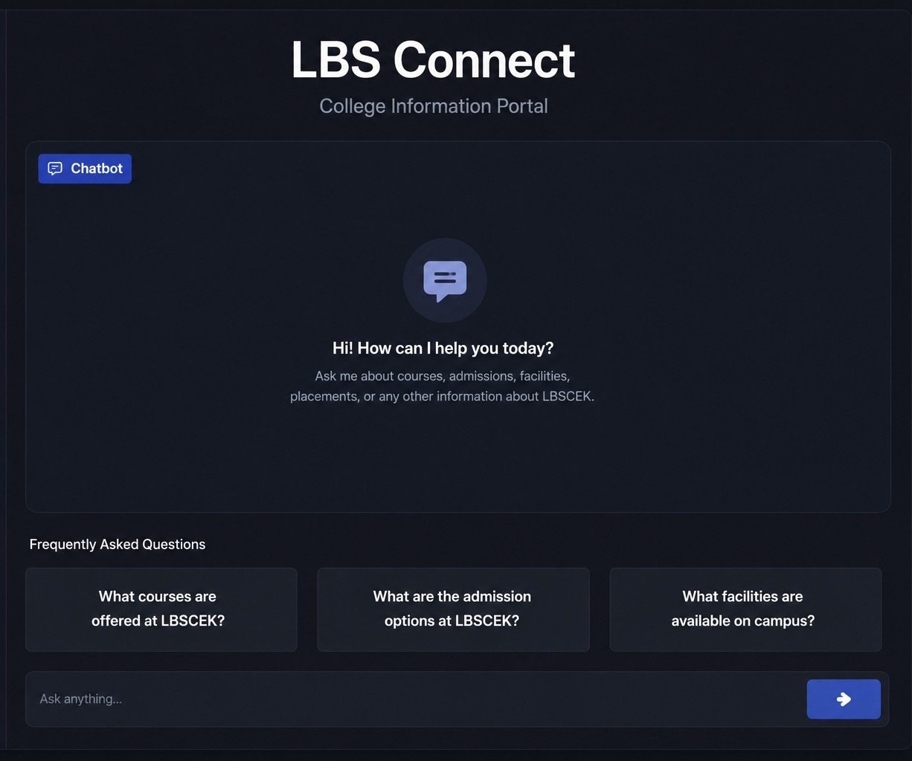
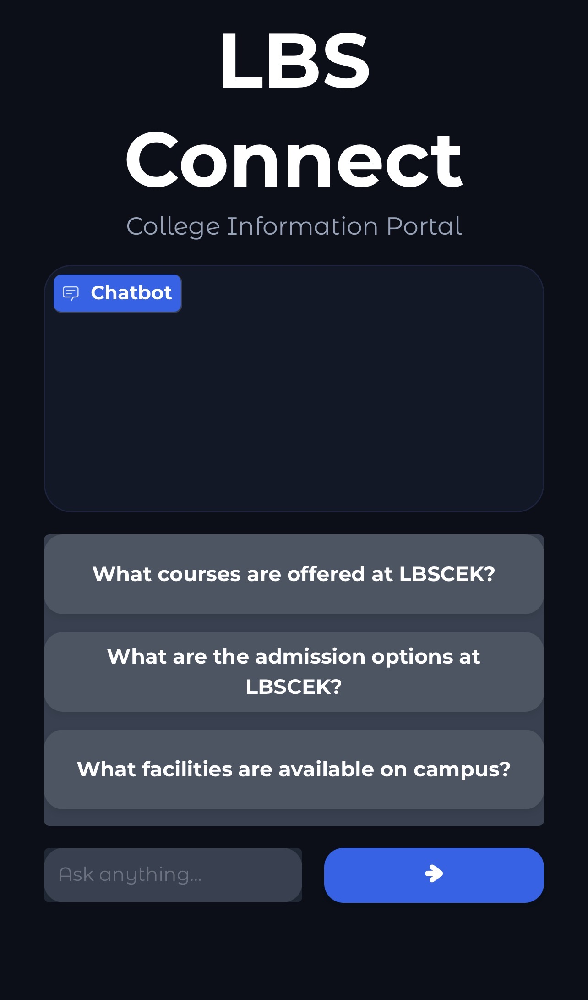
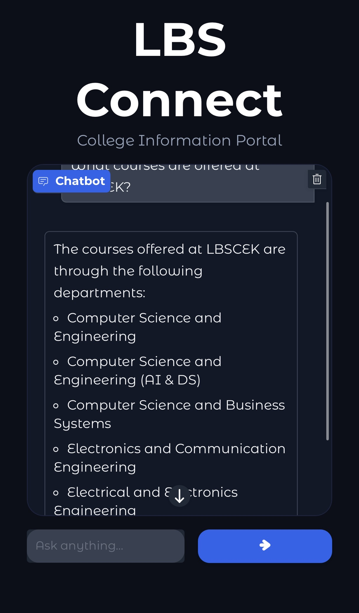
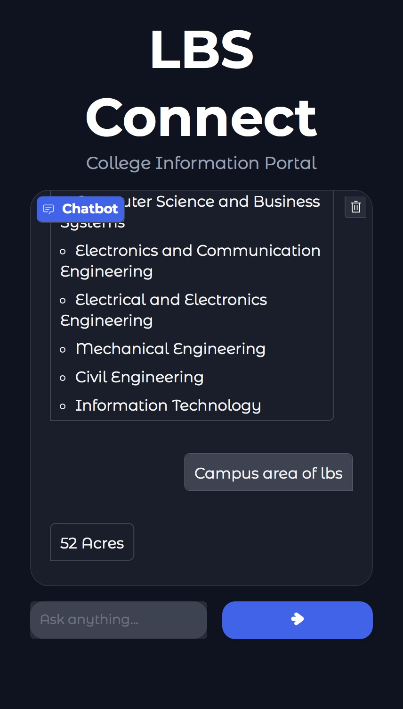

# LBS Connect

An AI-powered college information assistant developed for providing quick and accurate information about LBS College of Engineering.

##  Live Demo

https://shaheem1771-lbsconnect.hf.space

---

##  Features

- AI-powered chatbot using Groq LLM
- Course and department information
- Admission guidance
- Campus facilities information
- College contact and website support
- FAQ quick-access cards
- Responsive dark-themed interface
- Fast response generation
- Knowledge-base powered answers

---

## Tech Stack

- Python
- Gradio
- Groq API
- Sentence Transformers
- FAISS Vector Search

---

## Screenshots

### Home Page


### FAQ Section


### Chat Interface


### Response Example


---

##  Project Structure

```text
LBS-Connect/
│
├── app.py
├── knowledge.txt
├── requirements.txt
├── README.md
└── assets/
```

---

##  Installation

```bash
git clone https://github.com/shaheem1771/LBS-Connect.git

cd LBS-Connect

pip install -r requirements.txt

python app.py
```

---

##  How It Works

1. User asks a question.
2. Relevant information is retrieved from the knowledge base.
3. Context is sent to Groq LLM.
4. AI generates an accurate response.
5. Answer is displayed through the Gradio interface.

---

## Future Improvements

- Enhanced RAG implementation
- Query analytics dashboard
- Multi-language support
- Admin knowledge-base editor
- Student feedback collection
- Voice input support
- Mobile application version

---

##  Author

**Muhammed Shaheem**

GitHub: https://github.com/shaheem1771
